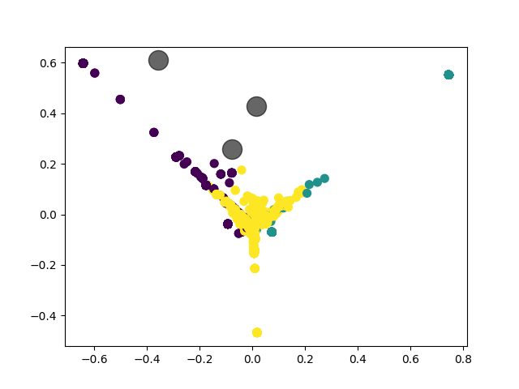
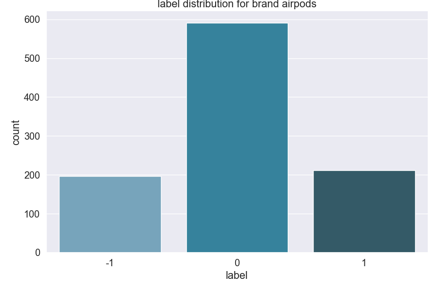
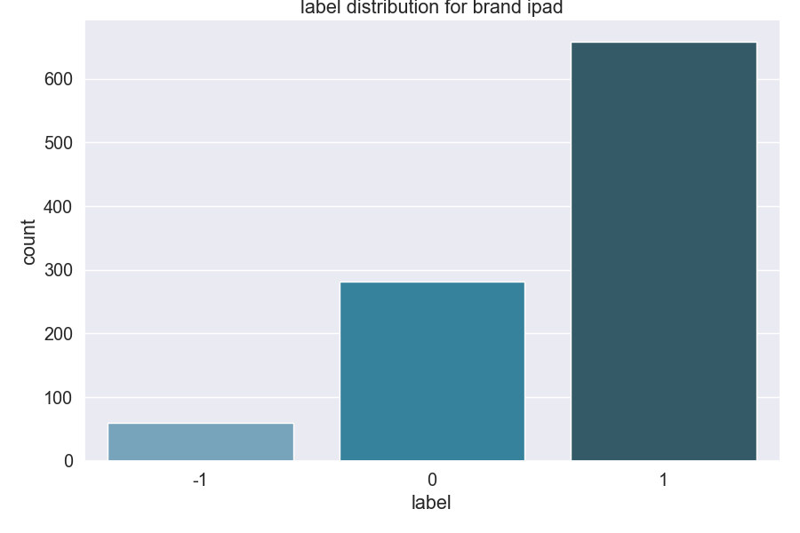
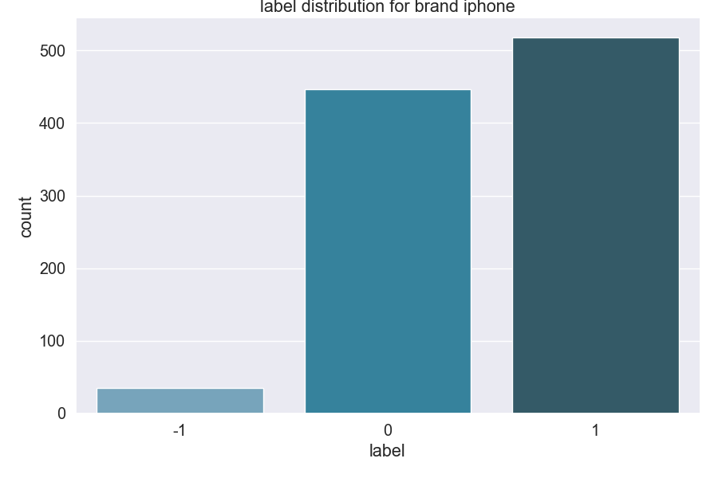
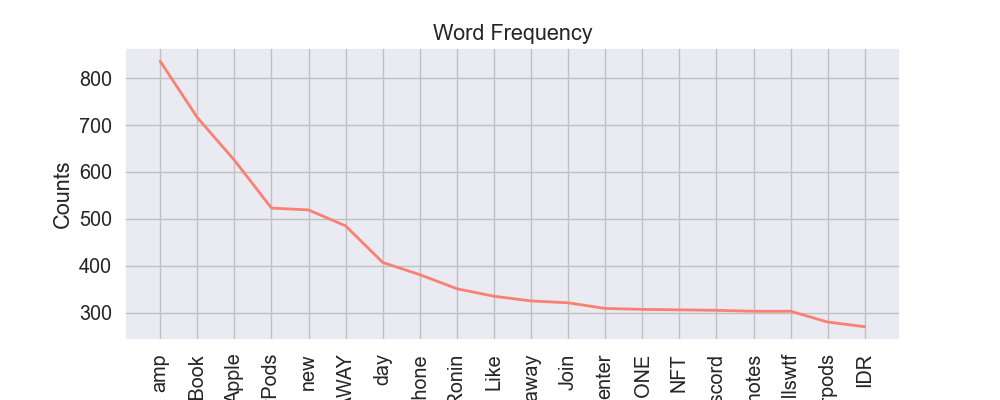

# Opinion_Detection

The objective of this project is to build a classification tool to classify tweets about specified brands using Machine Learning algorithms. 

This first version tries to classify tweets of the following brands : iPhone,iPad,MacBook and AirPods. 
The tweets are labelised in to 3 categories : positive, negative and neutral. 

## Getting and storing the data
Data are fetched using the twitter API, with specific secret tokens that are for personal use. 
The storage is then done in a SQL Server local dataBase. In total, 1000 tweets are saved for each brand. 
The tweets are labelised using Affon library for python, with the following understanding :
-1 : negative
0 : neutral
1: positive

## Analysing the data 
Here is a simple analysis of the tweets in the dataBase. 

We can see that the label distribution is very unbalanced, with few negative tweets. 

Here, the 20 most frequent words in the dataset.

## Classification of tweets

This first version classify the tweets using a SVM classifier with linear kernel. 
The accuracy score of the classifier is 88.58 %

