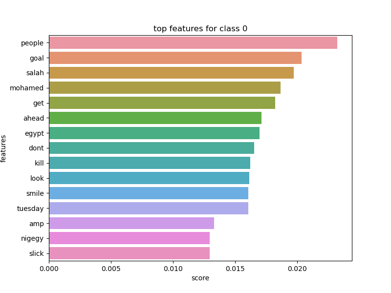

## DISCLAIMER
Work in progress !!!!!!!!!!!!!!!!!!!!!!!!!!!!!!!!!!!!!!!!!!!!!!!!!!!!!!!!!!!!!

# Opinion_Detection

The objective of this project is to build a classification tool to classify tweets about specified brands using Machine Learning algorithms. 
This first version tries to classify tweets of the following brands : iPhone,iPad,MacBook and AirPods. 
The tweets are labelised in to 3 categories : positive, negative and neutral. 

## Getting and storing the data
Data are fetched using the twitter API, with specific secret tokens that are for personal use. 
The storage is then done in a SQL Server local dataBase. In total, 1000 tweets are saved for each brand. 

## Classification of tweets
Labellizing tweets manually would be a time consuming task.
Classification here is made with unsupervised learning, using kmeans algorithm. 
Here, the clustering of the dataset made by kmeans : 

For each class, we can see the most frequent features : 

