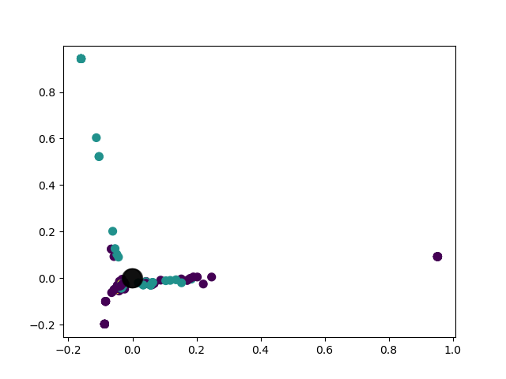
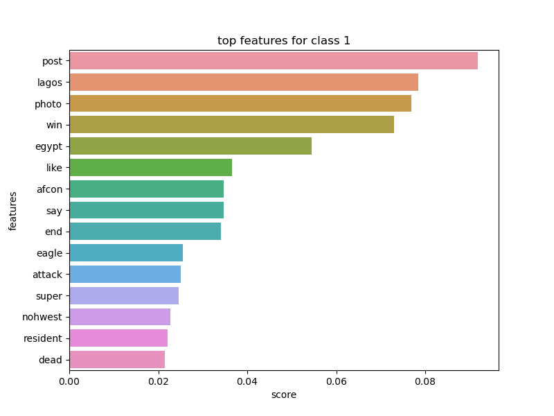
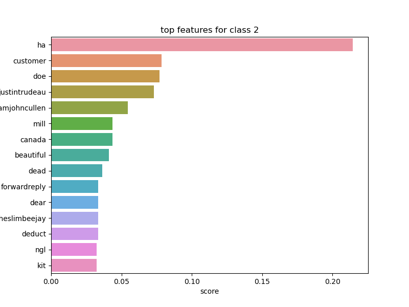

## DISCLAIMER
This project is in progress, the results presented are constantly being updated.

# Opinion_Detection

The objective of this project is to build a classification tool to classify tweets about specified brands or topics using Machine Learning algorithms. \n
This version tries to classify tweets of the following topic : Nigeria. \n
The tweets are labelised in to 3 categories : positive (2), negative(1) and neutral (0). 

## Getting and storing the data
Data are fetched using the twitter API, with specific secret tokens that are for personal use. 
The storage is then done in a SQL Server local dataBase. \n
The dataBase contains 370 tweets for now.

## Preview of the dataset
The main words in the dataset are : 

## Classification of tweets

### SVM Classifier 

To train a SVM classifier, data are labellised by hand before being stored in the database. 
They are then transformed using TF-IDF method. 
The results of the classifier are not very satisfying : \n

accuracy for SVM classifier : 0.6666666666666666 \n
precision for SVM classifier : [0.5        0.76744186 0.88888889] \n
recall for SVM classifier : [0.75757576 0.75       0.47058824]\n

Here an overview of the labels predicted by the svm \n

And the actual labels : \n

\n

-> The model needs more data so : To be continued !

### Kmeans classifier

Labellising by hand is a very laborious task, so we may want to use an unsupervised ML algorithm like Kmeans to cluster tweets. \n

For this method, the text is transformed with word2vec model. \n
 
Here, the clustering of the dataset made by kmeans : \n

\n

For each class, we can see the most frequent features : 

\n
As we can see, the algorithm isn't performing very well. \n
It clearly needs more data and tuning. 
//TODO 

